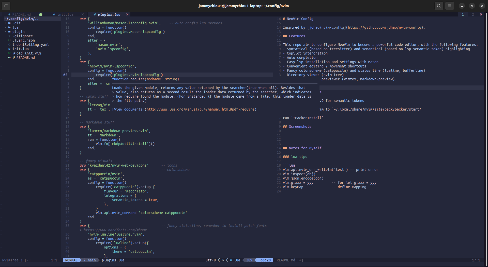
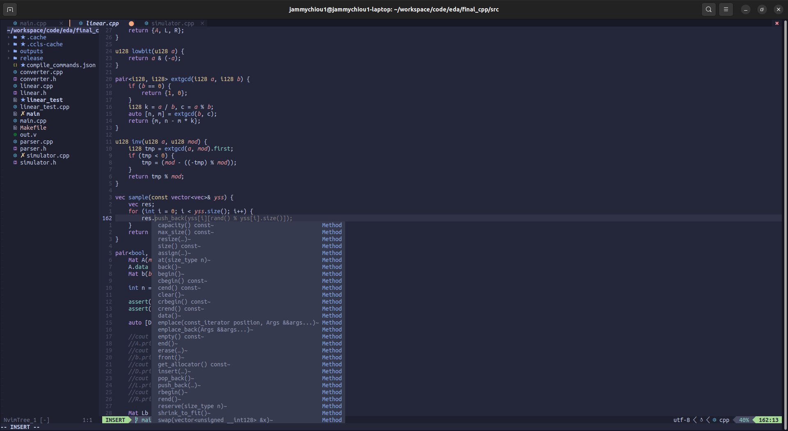

# NeoVim Config

Inspired by [jdhao/nvim-config](https://github.com/jdhao/nvim-config).

## Features

This project aims to configure NeoVim to become a powerful code editor, with the following features:
- Syntatical (based on treesitter) and semantical (based on lsp semantic token) highlighting
- Copilot intergration
- Auto completion
- Easy lsp installation and settings with mason
- Convenient editing / movement shortcuts
- Fancy colorscheme (catppuccin) and status line (lualine, bufferline)
- Directory viewer (nvim-tree)
- LaTeX / Markdown previewer (vimtex, markdown-preview)
- ...And more

## Installing

- Install neovim >= 0.9 for semantic tokens
- Clone this repo to `~/.config/nvim/`
- Download packer.nvim to `~/.local/share/nvim/site/pack/packer/start/`
- Run `:PackerInstall`

## Screenshots





## Notes for Myself

### Lua Tips

```lua
vim.api.nvim_err_writeln('test')    -- print error
vim.inspect(obj)
vim.json.encode(obj)                -- object to easy-to-read text
vim.g.xxx = yyy                     -- for let g:xxx = yyy
vim.keymap.set / del(...)           -- define key mapping
```
